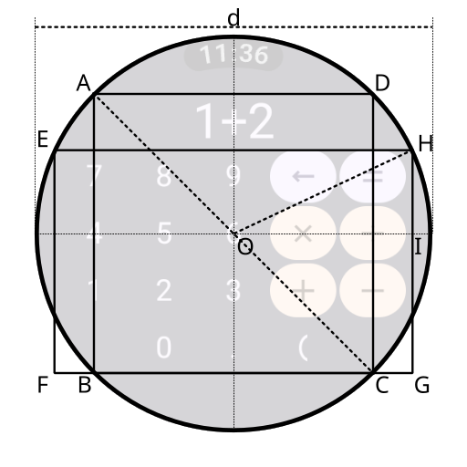

# Constants in `CalculatorScreen.kt`

This document describes how the following constants used in `CalculatorScreen.kt` are derived:

* `INSCRIBED_RATIO`
* `PANEL_RATIO`

## Assumptions



* The display area is a circle with diameter `d`.
* Quadrilateral `ABCD` is a square inscribed in the display area.
* Quadrilateral `EFGH` has vertices `E` and `H` on the circumference of the display area.
* Sides `BC` and `FG` lie on the same line.
* The ratio of the side length of square `ABCD` to `EF` (or `GH`) is 5:4.
* Point `I` is the foot of the perpendicular from `H` to the horizontal line passing through the center `O`.

`INSCRIBED_RATIO` represents the ratio of the side length `AB` of the inscribed square `ABCD` to the
diameter `d` of the display area.

`PANEL_RATIO` represents the ratio of the side length `EH` to the diameter `d` of the display area.

## Quadrilateral ABCD

`ABCD` is a square, and its diagonal `AC` is equal to the diameter `d` of the display area.

For a square, the diagonal is $\sqrt{2}$ times the side length:

$$
AC = \sqrt{ 2 } \cdot AD
$$

Therefore,

$$
AD = \frac{ 1 } { \sqrt{ 2 } } d
$$

Since all sides of `ABCD` have the same length,

$$
AB = BC = CD = AD = \frac{ 1 } { \sqrt{ 2 } } d
$$

Thus,

$$
INSCRIBED\\_RATIO = \frac{ 1 } { \sqrt{ 2 } } \approx 0.70710678118654752440084436210485...
$$

## Quadrilateral EFGH

The side lengths of `ABCD` and `EFGH` satisfy

$$
GH = \frac{ 4 }{ 5 }CD
$$

First, calculate the vertical distance `HI`.

From the geometry shown in the diagram,

$$
HI = \frac{ 1 }{ 2 } CD - ( CD - GH )
$$

Therefore,

$$
\begin{aligned}
HI &= \frac{ 1 }{ 2 } CD - CD + GH\\
&= -\frac{ 1 }{ 2 } CD + \frac{ 4 }{ 5 } CD\\
&= \frac{ 3 }{ 10 } CD\\
&= \frac{ 3 }{ 10 } \cdot \frac{ 1 } { \sqrt{ 2 } } d\\
&= \frac{ 3 }{ 10 \sqrt{ 2 } } d\\
\end{aligned}
$$

Since `H` lies on the circumference of the display area,

$$
OH = \frac{ 1 }{ 2 } d
$$

Triangle `OIH` is a right triangle. Applying the Pythagorean theorem,

$$
\begin{aligned}
OI &= \sqrt{ OH^2 - HI^2 }\\
&= \sqrt{ ( \frac{ 1 }{ 2 } d )^2 - ( \frac{ 3 }{ 10 \sqrt{ 2 } } d )^2 }\\
&= \sqrt{ \frac{ 1 }{ 4 } d^2 - \frac{ 9 }{ 200 } d^2 }\\
&= \sqrt{ \frac{ 41 }{ 200 } } d\\
\end{aligned}
$$

Since `O` is the center of the circle and `OI` is perpendicular to chord `EH`, `OI` bisects `EH`, so

$$
EH = 2 \cdot OI
$$

Therefore,

$$
\begin{aligned}
EH &= 2\sqrt{ \frac{ 41 }{ 200 } } d\\
&= \sqrt{ \frac{ 41 }{ 50 } } d\\
\end{aligned}
$$

Thus,

$$
PANEL\\_RATIO = \sqrt{ \frac{ 41 }{ 50 } } \approx 0.90553851381374166265738081669841...
$$

## Summary

The mathematical values of the two ratios are:

$$
\begin{aligned}
INSCRIBED\\_RATIO &= \frac{ 1 } { \sqrt{ 2 } } \approx 0.70710678118654752440084436210485...\\
PANEL\\_RATIO &= \sqrt{ \frac{ 41 }{ 50 } } \approx 0.90553851381374166265738081669841...\\
\end{aligned}
$$

The application stores these values as `Float`, so the values are rounded to `Float` precision in
the source code:

```kotlin
const val INSCRIBED_RATIO: Float = 0.70710677f
const val PANEL_RATIO: Float = 0.9055385f
```
